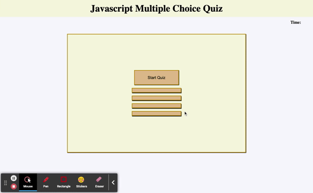

# Title 
Javascript code quiz

## Link to deployed application
https://adachika.github.io/code-quiz/

## Description
The goal of this project is to design a timed multiple choice quiz using Javascript. The quiz utilized Javascript arrays and objects to store questions. A time interval function was used to begin a countdown timer. Eventlistener was added to display the multiple choice questions to the user once the start button is clicked. It was also used to check if the user selected the correct answer. If an incorrect answer is selected, the timer subtracts 10 seconds from the allotted time. Once the user has answered all questions or if the timer reaches zero before all questions are attempted, the quiz is over and the final score is displayed to the user. The user is presented with the option to enter their initial to view highscores. Local storage is used to keep track of all previous scores and the scores are in descending order from highest to lowest.



## Code snippet of countdown timer function
```
function setTime() {
    var timerInterval = setInterval(function() {
      timeLeft--;
      timeEl.textContent = timeLeft + "s";
  
      if(timeLeft === 0 || currentIndex === questions.length) {
        clearInterval(timerInterval);
        timeEl.textContent = "";
        alert("All done");
        results();
      }
      //The second argument that the setInterval() method takes is the interval. Because intervals use milliseconds, we use 1000 to create an interval of one second
    }, 1000);
  }
}

```
## Framework
- HTML
- CSS
- Javascript
- Local Storage

### Credits
https://github.com/yyazdi13/multiplechoicequiz

